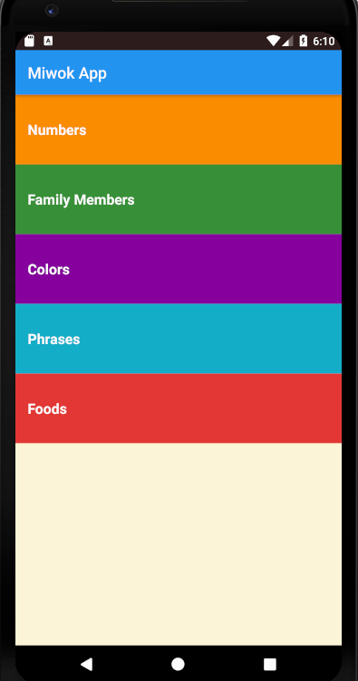
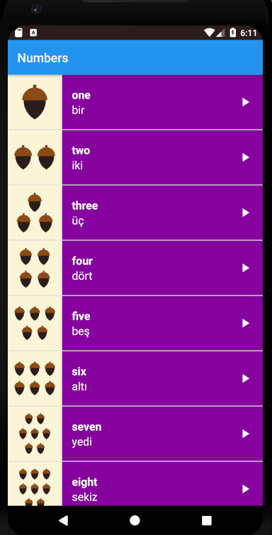
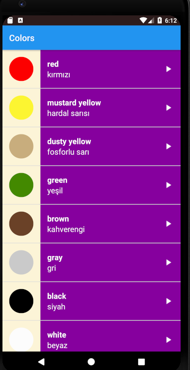
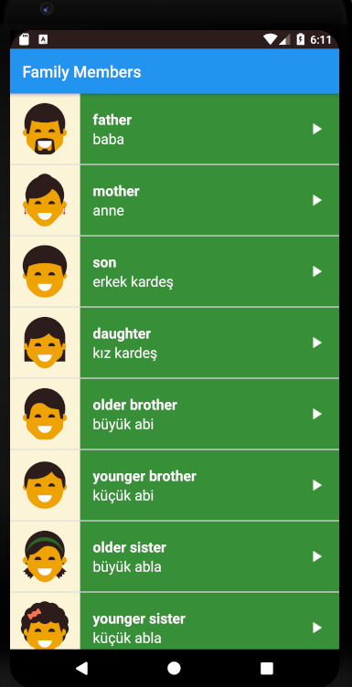
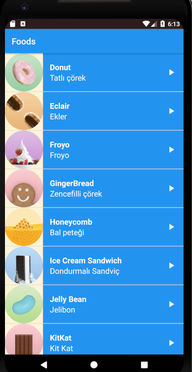
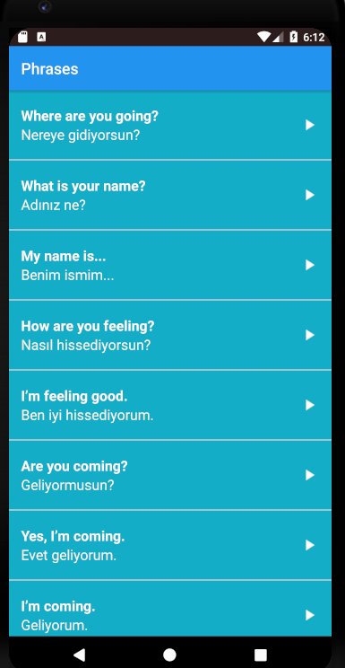

Bu projede birden fazla 'Activity' oluşturarak ArrayList kullanarak bir list_view yardımıyla ilk olarak bir kelimenin Türkçe ve İnglizce karşılığını yazdırdım.
Daha sonra projeye listenin içindeki her kelimenin İnglizce dilinde telaffuzu olan ses dosyaları ekledim.

Ana sayfa :

<figure>
 
 <figcaption>
 

 
 </figcaption>
</figure>

Sayılar Aktivitesi(Numbers Activity) :

<figure>
 
 <figcaption>
 

 
 </figcaption>
</figure>

Renkler Aktivitesi (Colors Activity) :

<figure>
 
 <figcaption>
 

 
 </figcaption>
</figure>

Aile Üyeleri Aktivitesi (Family Activity) :

<figure>
 
 <figcaption>
 

 
 </figcaption>
</figure>

Yiyecekler Aktivitesi (Foods Activity) :

<figure>
 
 <figcaption>
 

 
 </figcaption>
</figure>

Diyaloglar Aktivitesi (Phrases Activity) :

<figure>
 
 <figcaption>
 

 
 </figcaption>
</figure>

Referanslar:

https://developer.android.com/reference/android/media/AudioManager.html?utm_source=udacity&utm_medium=course&utm_campaign=android_basics#AUDIOFOCUS_GAIN

https://developer.android.com/guide/components/services.html

https://medium.com/google-developers/how-to-properly-handle-audio-interruptions-3a13540d18fa#.jkibca8ml

https://developer.android.com/guide/topics/media-apps/audio-focus

https://www.tutorialspoint.com/android/android_mediaplayer.htm

https://developer.android.com/reference/android/widget/ArrayAdapter.html?utm_source=udacity&utm_medium=course&utm_campaign=android_basics

https://developer.android.com/guide/topics/ui/layout/recyclerview#java

https://guides.codepath.com/android/Using-an-ArrayAdapter-with-ListView

https://colab.research.google.com/drive/1ZyZGkdhV8_HYCWrZMD-7TfVRpQM3T_SU#scrollTo=peHBwA27S4kA

https://medium.com/google-developers/how-to-properly-handle-audio-interruptions-3a13540d18fa#.jkibca8ml

https://material.io/resources/icons/?style=baseline

https://stackoverflow.com/questions/17851687/how-to-handle-the-click-event-in-listview-in-android

