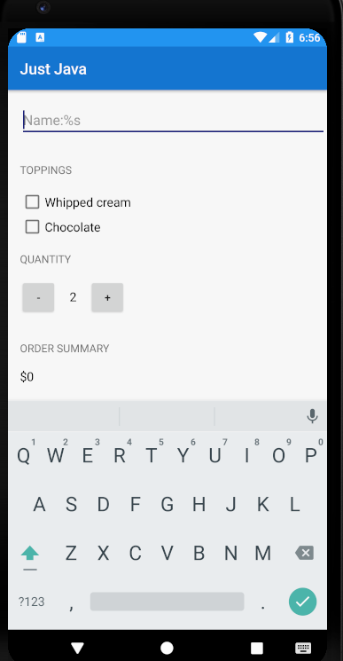
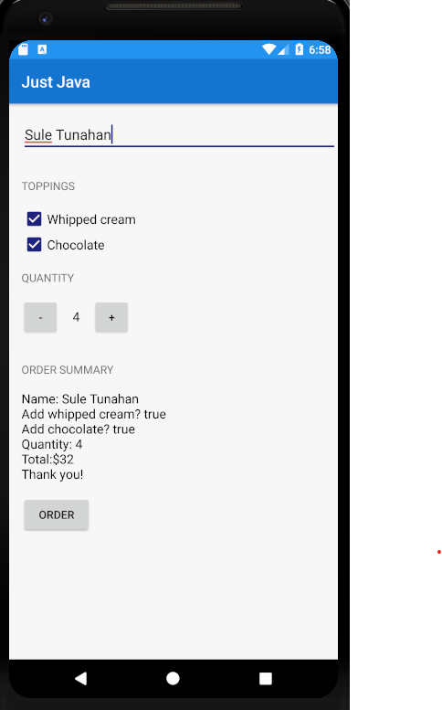

Android framework de butonları,edittext,textview,checkbox kullandım.

Uygulamada ilk başta isim gireriz daha sonra krema veya çikolata sos istersek checkbox'ı işaretleriz.
Sonra kaç adet istiyorsak + veya - butonlarını kullanarak kahve sayısını belirleriz.
En son Order butonu bize bir özet şeklinde fiyatın bulunduğu bir metin sunar.
Burda son olarak bu özet metni başkasına email atılması için email ile bağlantı kuruldu.

Ekran görüntüleri:

<figure>
 
 <figcaption>
 

 
 </figcaption>
</figure>

<figure>
 
 <figcaption>
 

 
 </figcaption>
</figure>

<figure>
 
 <figcaption>
 

 
 </figcaption>
</figure>